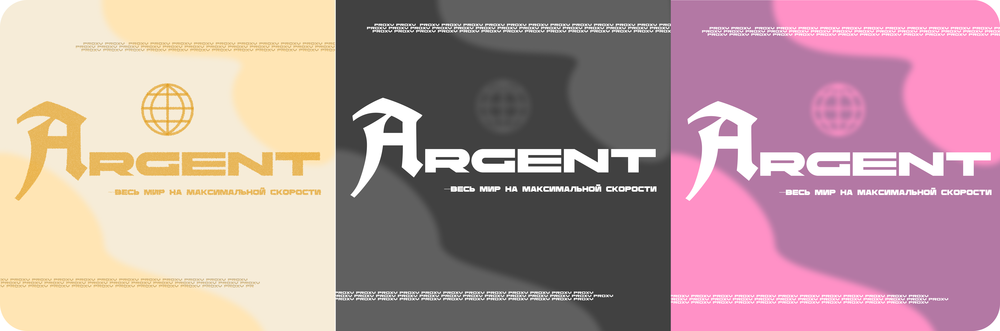

<h1 align="center"><b>Argent Digital 🌐</b>
<p style="margin-bottom: 0px; font-size: 18px; margin-left: -5px">-deployment process</p></h1>
<p align="center">
  
</p>

<div align="left">
<p><i>
Argent Core serves as the central nervous system of the Argent ecosystem. It orchestrates user management, subscription logic, and database integrity, acting as the primary backend hub for all peripheral services.</i>

<b>Technical Stack
API Framework:</b> FastAPI for high-performance endpoint handling.

<b>Database:</b> PostgreSQL 18 (the latest enterprise-standard).

<b>ORM & Migrations:</b> SQLAlchemy for database interaction and Alembic for seamless schema migrations.

<b>Routing:</b> Custom implementation using httpx for efficient inter-service communication.

<b>Infrastructure:</b> Fully containerized via Docker and Docker Compose.</p>
</div>

<hr style="border-bottom: 1px solid #ccc;">

<p style="font-size: 40px"><b>-Deploy</b></p>

<p style="margin-bottom: -15px">1. Cloning repository:<p>

```bash
git clone https://github.com/Argent-Digital/Argent-vpn-service.git
git clone https://github.com/Argent-Digital/Argent-core.git
git clone https://github.com/Argent-Digital/Argent-nginx.git
git clone https://github.com/Argent-Digital/Argent-bot.git
git clone https://github.com/Argent-Digital/Argent-pay-service.git
```
<p>2. Each service requires specific environment variables to function correctly. You will find an `.env.example` file in the root directory of each repository. Fill in all the information.</p>

<p style="margin-bottom: 0px">3. Once all environment files are configured, return to the main project directory and deploy the entire ecosystem using Docker Compose:</p>

```bash
docker compose up --build -d
```

<div>
<p>
<b>🌐 Network & Security Requirements</b>
Before launching, ensure the following ports are open on your host machine:
80 (HTTP): Required for domain validation and initial traffic.
443 (HTTPS): Required for encrypted production traffic.

<b>SSL/TLS:</b> The system is prepared for Certbot integration. Once your DNS A-records are pointed to your server IP, the Nginx container will handle the SSL handshake and automated certificate renewal, ensuring your domains remain secure without manual intervention.</p>

```bash
docker exec -it argent-nginx certbot certonly --webroot -w /var/www/certbot -d your-domain.com
```

<p>
⚖️ <b>Licensing & Customization</b>
This project is distributed under the Apache License 2.0. You are free to modify, extend, and adapt the system design to your needs. Feel free to dive into the containerized services and tweak the core logic or UI components as you see fit!

<b>Argent Digital — Весь мир на максимальной скорости.</b>
</p>
</div>

<p align="center">
  
</p>